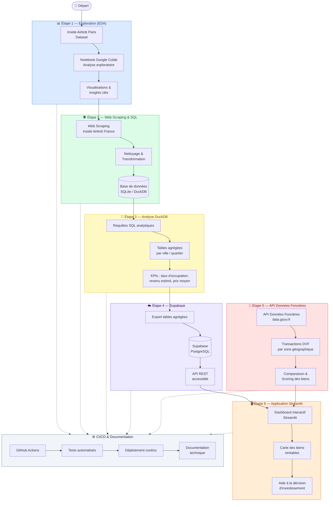

# 🏠 Airbnb Analytics — France

> Projet d'analyse des données Airbnb en France, enrichi de données immobilières, avec une pipeline CI/CD et une application web interactive.

---

## 📋 Table des matières

- [Vue d'ensemble](#vue-densemble)
- [Architecture du projet](#architecture-du-projet)
- [Étapes du projet](#étapes-du-projet)
  - [Étape 1 — Exploration des données (EDA)](#étape-1--exploration-des-données-eda)
  - [Étape 2 — Web Scraping & Base de données SQL](#étape-2--web-scraping--base-de-données-sql)
  - [Étape 3 — Analyse avec DuckDB & Tables agrégées](#étape-3--analyse-avec-duckdb--tables-agrégées)
  - [Étape 4 — Supabase & Déploiement de la base](#étape-4--supabase--déploiement-de-la-base)
  - [Étape 5 — API Données Foncières (data.gouv.fr)](#étape-5--api-données-foncières-datagouvfr)
  - [Étape 6 — Application Streamlit](#étape-6--application-streamlit)
- [CI/CD & Documentation technique](#cicd--documentation-technique)
- [Environnement recommandé](#environnement-recommandé)
- [Structure du dépôt](#structure-du-dépôt)
- [Licence](#licence)

---

## Vue d'ensemble

Ce projet vise à analyser les données **Inside Airbnb** pour la France, à les enrichir de données immobilières via l'**API Données Foncières** (data.gouv.fr), et à exposer les résultats dans une **application Streamlit**. Il s'agit d'un outil d'aide à la décision pour la sélection de biens immobiliers à fort potentiel locatif court terme.

---

## Architecture du projet



---

## Étapes du projet

### Étape 1 — Exploration des données (EDA)

**Objectif :** Comprendre en profondeur le jeu de données *Inside Airbnb* pour Paris.

- Téléchargement du dataset Paris depuis [Inside Airbnb](http://insideairbnb.com/get-the-data/)
- Analyse exploratoire : distributions, valeurs manquantes, corrélations
- Visualisations des prix, types de logements, quartiers et taux d'occupation
- Identification des variables clés pour les étapes suivantes

> 💡 **Outil recommandé :** Google Colab pour bénéficier de ressources cloud adaptées à la volumétrie des données.

📁 Notebook : [`notebooks/eda.ipynb`](notebooks/eda.ipynb)

---

### Étape 2 — Web Scraping & Base de données SQL

**Objectif :** Collecter les données Airbnb pour l'ensemble de la France et les stocker dans une base SQL.

- Scraping automatisé des listings Airbnb par ville/région
- Nettoyage et normalisation des données collectées
- Peuplement d'une base de données **SQLite** ou **DuckDB** locale
- Schéma relationnel : `listings`, `reviews`, `calendar`, `neighbourhoods`

> 💡 **Outil recommandé :** Google Colab + bibliothèques `requests`, `BeautifulSoup`, `pandas`, `SQLAlchemy`

---

### Étape 3 — Analyse avec DuckDB & Tables agrégées

**Objectif :** Créer des requêtes analytiques et des tables agrégées pour extraire des KPIs.

- Requêtes SQL pour l'analyse par ville, quartier et type de bien
- Calcul des KPIs : taux d'occupation estimé, revenu mensuel moyen, prix par nuit médian
- Création de tables agrégées optimisées pour la visualisation
- Utilisation de **DuckDB** pour des performances élevées sur de grands volumes

---

### Étape 4 — Supabase & Déploiement de la base

**Objectif :** Rendre les données accessibles à la future application web via Supabase.

- Export des tables agrégées vers **Supabase** (PostgreSQL managé)
- Configuration des rôles et accès sécurisés
- Exposition via l'API REST Supabase
- Tests de connectivité depuis l'application Streamlit

---

### Étape 5 — API Données Foncières (data.gouv.fr)

**Objectif :** Enrichir les données Airbnb avec des données immobilières open data pour faciliter la sélection de biens.

- Connexion à l'**[API Données Foncières](https://www.data.gouv.fr/dataservices/api-donnees-foncieres)** (Cerema / DGALN)
- Récupération des transactions immobilières issues de **DVF+** (Demandes de Valeurs Foncières) par zone géographique
- Accès aux indicateurs de prix de l'immobilier par commune et quartier depuis 2010
- Calcul du rendement locatif potentiel (revenus Airbnb estimés / prix d'achat)
- Scoring et classement des opportunités d'investissement

---

### Étape 6 — Application Streamlit

**Objectif :** Créer une interface web interactive pour explorer les données et aider à la décision.

- Dashboard avec carte interactive des biens rentables
- Filtres par ville, type de bien, budget, rendement cible
- Graphiques comparatifs Airbnb vs marché immobilier
- Déploiement sur **Streamlit Cloud** ou serveur dédié

---

## CI/CD & Documentation technique

Tout au long du projet, une pipeline CI/CD sera mise en place :

| Composant | Outil | Description |
|-----------|-------|-------------|
| Versioning | Git / GitHub | Gestion du code source |
| CI | GitHub Actions | Tests automatisés à chaque push |
| CD | GitHub Actions | Déploiement automatique de l'app Streamlit |
| Tests | pytest | Tests unitaires et d'intégration |
| Documentation | MkDocs / Docstrings | Documentation technique des scripts et API |
| Qualité du code | flake8 / black | Linting et formatage automatique |

---

## Environnement recommandé

Il est fortement conseillé d'utiliser **Google Colab** pour :
- Accéder à des ressources cloud (CPU/RAM) adaptées à la volumétrie des données
- Faciliter la collaboration et le partage des notebooks
- Expérimenter avec des environnements cloud (anticipation d'une architecture cloud)

```bash
# Installation locale (optionnelle)
pip install -r requirements.txt
```

---

## Structure du dépôt

```
Airbnb/
├── notebooks/              # Notebooks d'exploration et d'analyse
│   └── eda.ipynb           # EDA — Dataset Inside Airbnb Paris
├── data/                   # Données brutes et transformées (gitignore)
├── src/                    # Scripts Python (scraping, ETL, API)
│   ├── scraping/           # Web scraping Airbnb France
│   ├── etl/                # Transformation et chargement des données
│   └── api/                # Connexion API Données Foncières
├── sql/                    # Requêtes DuckDB et schémas SQL
├── app/                    # Application Streamlit
├── tests/                  # Tests unitaires et d'intégration
├── .github/workflows/      # Pipeline CI/CD GitHub Actions
├── docs/                   # Documentation technique
├── requirements.txt        # Dépendances Python
└── README.md               # Ce fichier
```

---

## Licence

Ce projet est sous licence [MIT](LICENSE).

---

<div align="center">
  <sub>Projet réalisé dans le cadre d'une analyse immobilière basée sur les données Airbnb 🏠</sub>
</div>
